# Bank Marketing Campaign Prediction

## Overview

This project develops and compares multiple machine learning models to predict 
whether a customer will subscribe to a term deposit using the UCI Bank Marketing
dataset. The workflow includes exploratory data analysis, feature engineering, 
feature selection, hyperparameter tuning, model evaluation, and model interpretation.

---

## Dataset

The data is related to direct marketing campaigns (phone calls) of a Portuguese banking    
institution. The dataset contains 45,211 customers with 16 input features. 
The classification goal is to predict if the client will subscribe to a term deposit (variable *y*). 
The dataset is sourced from the UCI Machine Learning Repository. Key decisions:
- No missing values.
- The feature *duration* was excluded because it is only available after a call is completed. 
Since *y* is known at that point, using duration for prediction would not be realistic for an actual campaign.
- Categorical variables were encoded for modeling.
- Feature selection retained only the most relevant predictors.

## Exploratory Data Analysis

### Target Class Distribution
First, we examine the subscription percentage to gain an initial understanding 
of the target variable y. Fig 1 illustrates the low subscription percentage for term deposits, 
indicating a need for the bank's marketing team to enhance their efforts.

 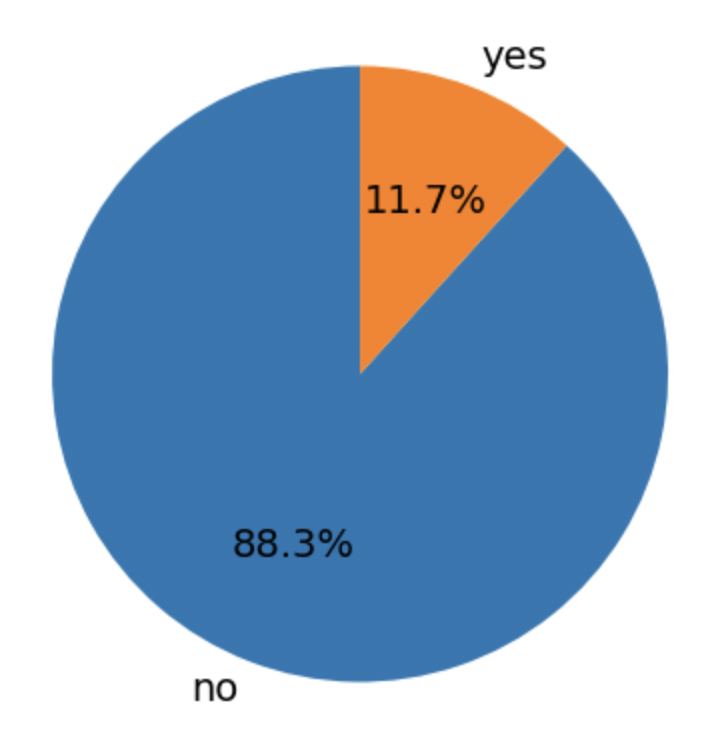 

Figure 1. Distribution of target classes.

### Numerical Feature Distributions

Histograms were used to examine the distributions of numerical variables.

 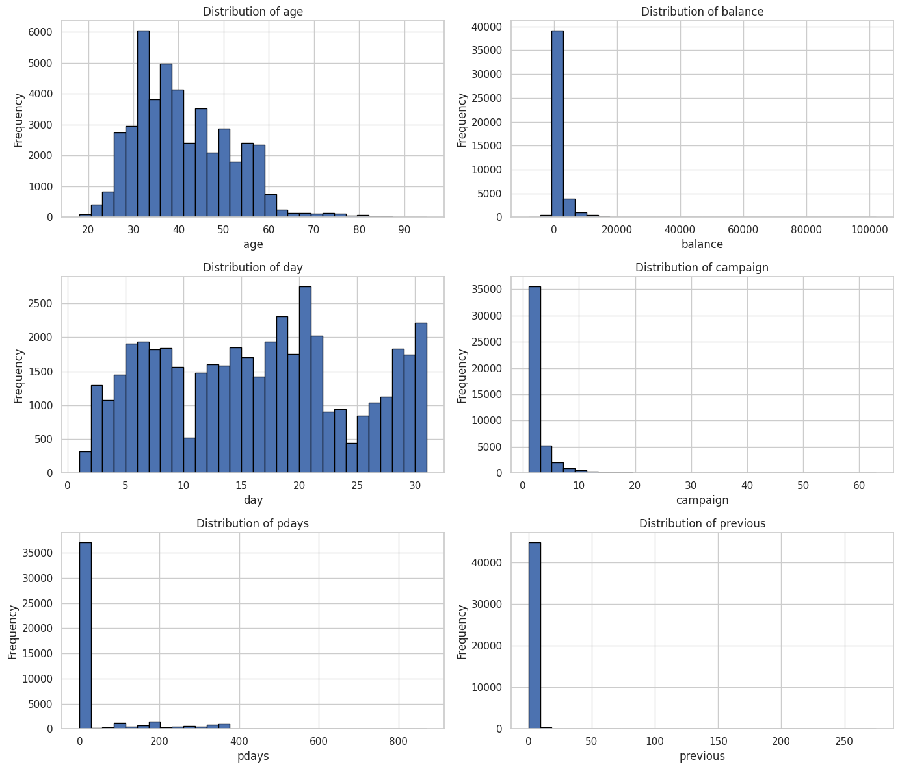 

Figure 2. Histograms of numerical features.

- *Balance* is highly right-skewed, with a small number of customers having very large account balances.
- *Campaign* is concentrated at low values, indicating that most customers were contacted only a few times.
- *Previous* is dominated by zeros, showing that most customers had not participated in earlier campaigns.
- *Pdays* contains many special values corresponding to customers who had never been contacted before.

These distributions suggest that the dataset contains substantial skewness and several extreme values.

### Outlier Analysis

Boxplots were used to visualize outliers in the numerical variables.

 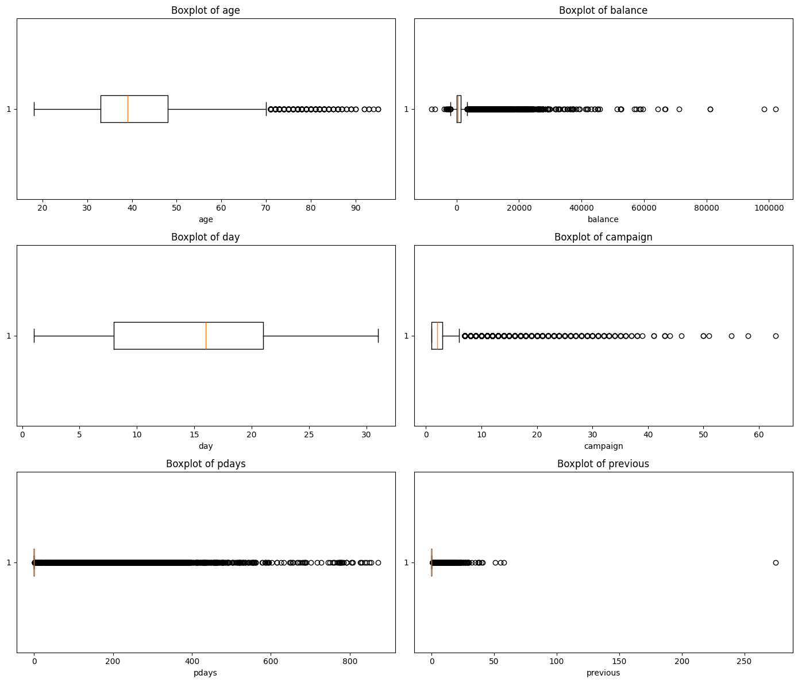 

Figure 3. Boxplots of numerical features.

Large outliers are present in variables such as *balance*, *campaign*, 
and *previous*. Rather than removing these observations, they were 
retained because they may represent legitimate customer behavior 
rather than measurement errors.

### Categorical Feature Distributions

The distributions of categorical variables were visualized using count plots.

 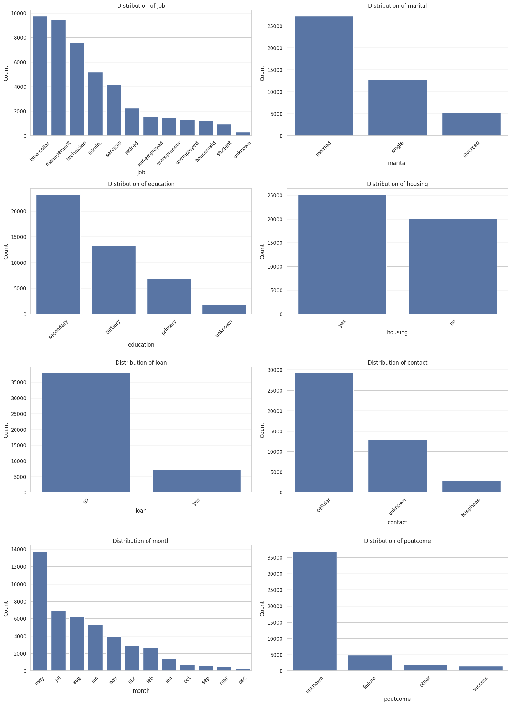 

Figure 4. Distribution of categorical variables.

- Blue-collar, management, and technician occupations appear most frequently.
- Most customers have housing loans, while fewer have personal loans.
- Cellular contact is substantially more common than telephone contact.
- Marketing campaigns occur more frequently during certain months.

These distributions provide useful context for understanding customer demographics before modeling.

### Subscription Rate by Feature

To better understand which characteristics are associated with successful marketing campaigns, 
we computed the subscription rate for different groups together with 95% confidence intervals.

 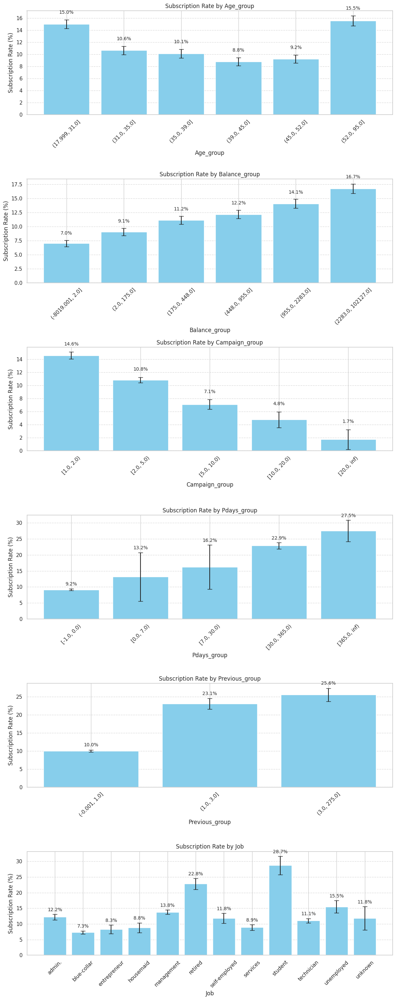 

Figure 5. Subscription rates with 95% confidence intervals.

Continuous variables were grouped into intervals using equal-frequency (qcut) or custom bins where appropriate. 
Here are some key observations:

- Subscription rates decrease sharply as the number of contacts increases, which suggests during the current campaign, repeatedly contacting the same customer is generally ineffective.

- Students have the highest subscription rate (28.7%). Their confidence interval is relatively wide, indicating greater uncertainty due to a smaller number of observations

- Customers who were contacted more recently in a previous campaign tend to have lower subscription rates than those contacted a long time ago.

### Age vs. Subscription

The age distribution was further examined by subscription outcome.

 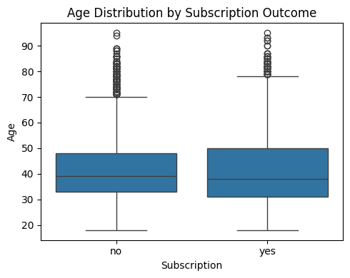 

Figure 6. Age distribution by subscription outcome.

Although the two groups overlap considerably, subscribers tend to have a slightly different age distribution,
indicating that age may contribute useful predictive information when combined with other variables.

### Correlation Analysis

A correlation matrix was computed for all numerical variables.

 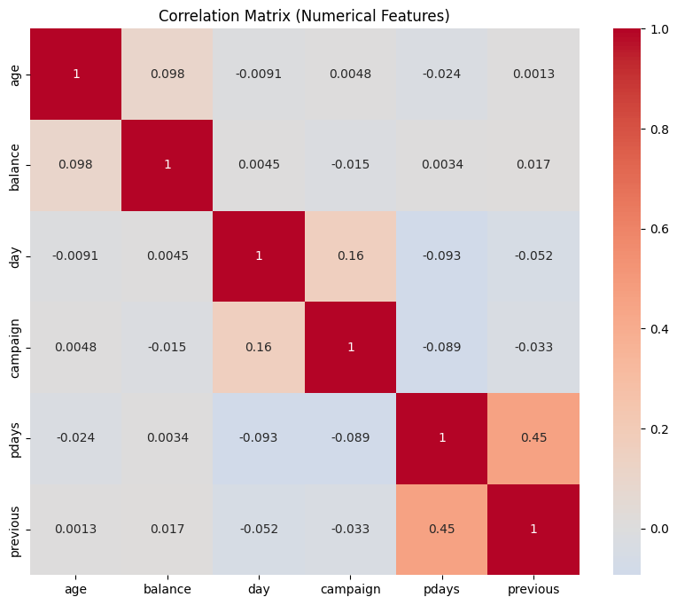 

Figure 7. Correlation matrix of numerical features.

Most numerical features exhibit relatively weak pairwise correlations, suggesting limited multicollinearity among the continuous variables. This indicates that each feature may contribute complementary information to the predictive models.

## Feature Selection

Categorical variables were converted into numerical form using one-hot encoding, while binary variables were mapped to 0 and 1.

A Random Forest classifier was then used to rank features by importance. Based on these rankings, four feature sets were created:

* Top 5 features
* Top 10 features
* Top 20 features
* All features

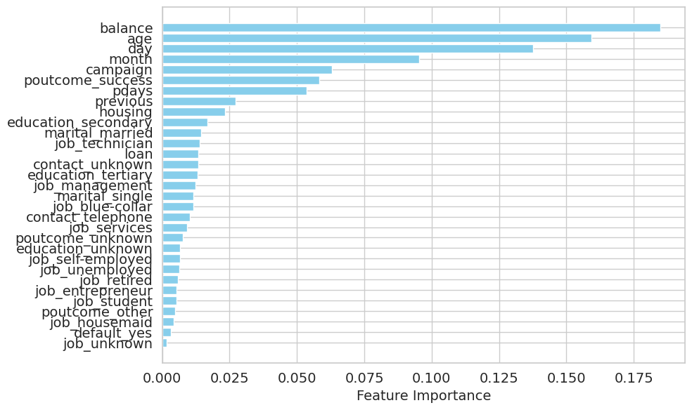

*Figure 8. Random Forest feature importance.*

## Variance Inflation Factor

Variance Inflation Factor (VIF) was calculated to check for multicollinearity among predictors.

$$
\mathrm{VIF}_i=\frac{1}{1-R_i^2}
$$

The feature *poutcome_unknown* has the highest VIF at 5.96, which still 
indicates only moderate multicollinearity.

## Model Selection

Four classification models were compared:

* Logistic Regression
* Random Forest
* Gaussian Naive Bayes
* XGBoost

Each model was evaluated using the Top 5, Top 10, Top 20, and full feature sets. 
Hyperparameters were tuned using grid search with 3-fold stratified cross-validation, 
and models were compared using mean F1 score because the target classes were imbalanced.

Random Forest with the Top 10 features achieved the best cross-validation performance 
and was selected as the final model.

| Model                | Best Feature Set    | Best Hyperparameters                                         |
| :------------------- | :------------------ | :----------------------------------------------------------- |
| Logistic Regression  | **All Features**    | `C = 100`, `penalty = l2`                                    |
| Random Forest        | **Top 10 Features** | `n_estimators = 500`, `max_depth = 10`                       |
| Gaussian Naive Bayes | **Top 20 Features** | `var_smoothing = 1e-12`                                      |
| XGBoost              | **Top 10 Features** | `n_estimators = 300`, `learning_rate = 0.1`, `max_depth = 5` |

## Final Model Evaluation

### Confusion Matrix and Classification Report

The final model was a Random Forest classifier with 500 trees, 
a maximum depth of 10, balanced class weights, and the Top 10 features.

| Actual \ Predicted |     No |   Yes |
| -----------------: | -----: | ----: |
|             **No** | 10,804 | 1,162 |
|            **Yes** |    778 |   820 |

| Class            | Precision | Recall |   F1-score | Support |
| :--------------- | --------: | -----: | ---------: | ------: |
| **No**           |    0.9328 | 0.9029 |     0.9176 |  11,966 |
| **Yes**          |    0.4137 | 0.5131 |     0.4581 |   1,598 |
| **Accuracy**     |         — |      — | **0.8570** |  13,564 |
| **Macro Avg**    |    0.6733 | 0.7080 |     0.6879 |  13,564 |
| **Weighted Avg** |    0.8717 | 0.8570 |     0.8635 |  13,564 |

The final model achieved an overall accuracy of 85.7%. It performed 
very well at identifying customers who did not subscribe (F1 = 0.918), 
while achieving a moderate F1 score (0.458) for the minority "Yes" class due 
to the dataset's class imbalance. This trade-off is reflected in the confusion 
matrix, where the model correctly identified 820 subscribers while missing 778 
and incorrectly predicting 1,162 non-subscribers as subscribers.

### Roc curve

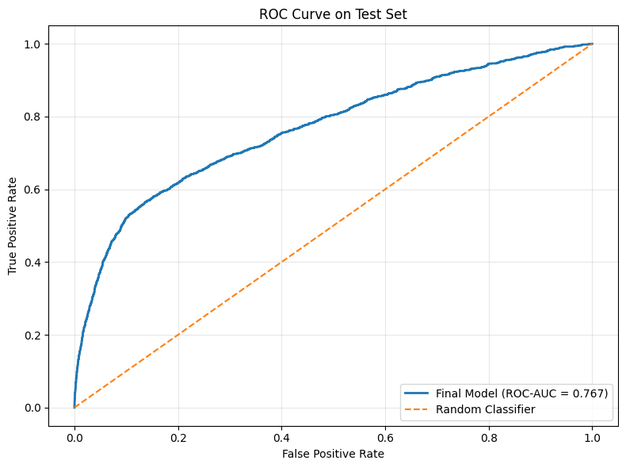

*Figure 9. ROC curve for the final model.*

The ROC curve lies well above the diagonal baseline, indicating that 
the model effectively distinguishes customers who subscribe from those who do not. 
The high ROC-AUC demonstrates strong overall classification performance across 
different decision thresholds.

### Precision-Recall Curve

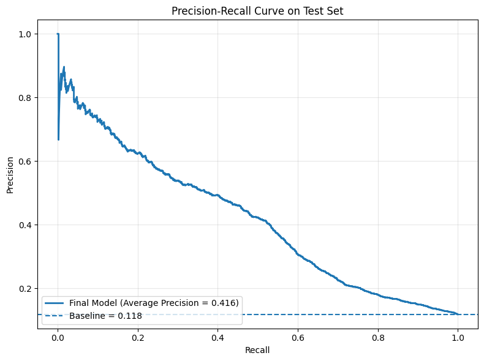

*Figure 10. Precision–Recall curve for the final model.*

The Precision–Recall curve provides a more informative evaluation for 
this imbalanced dataset. The model maintains good precision over a range of 
recall values, indicating that it can identify likely subscribers while limiting 
false positives.

### Profit by Threshold

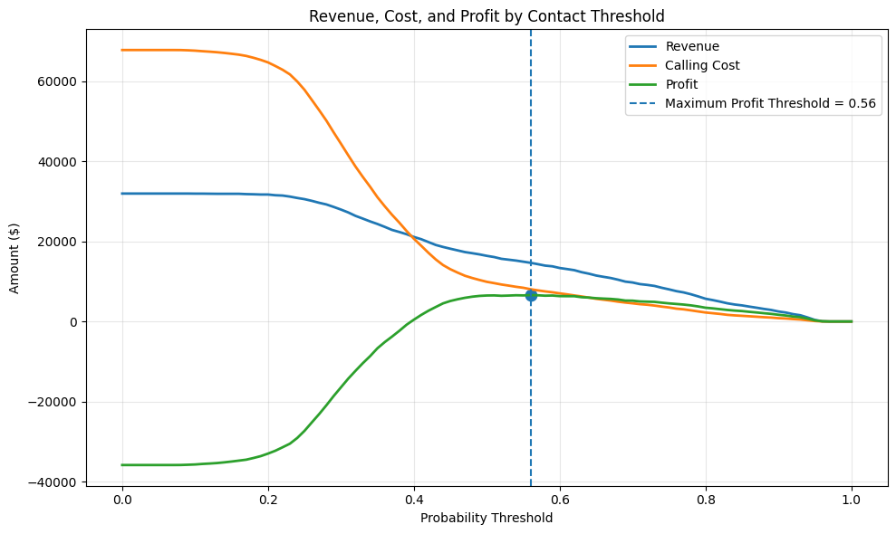

*Figure 11. Revenue, cost, and profit across probability thresholds.*

A lower threshold contacts more customers, increasing both potential
revenue and calling costs, while a higher threshold contacts fewer customers 
and reduces both.

In this analysis, the maximum estimated profit was achieved at a probability 
threshold of 0.56. At this threshold, the model contacts customers who are most 
likely to subscribe, balancing campaign cost and expected revenue more effectively 
than either contacting too many or too few customers.

## Model Interpretation with SHAP

To better understand the final Random Forest model, 
SHAP (SHapley Additive exPlanations) was used to explain both 
global feature importance and individual predictions.

### Global Feature Importance

The SHAP bar plot ranks features by their average impact on the model's predictions.

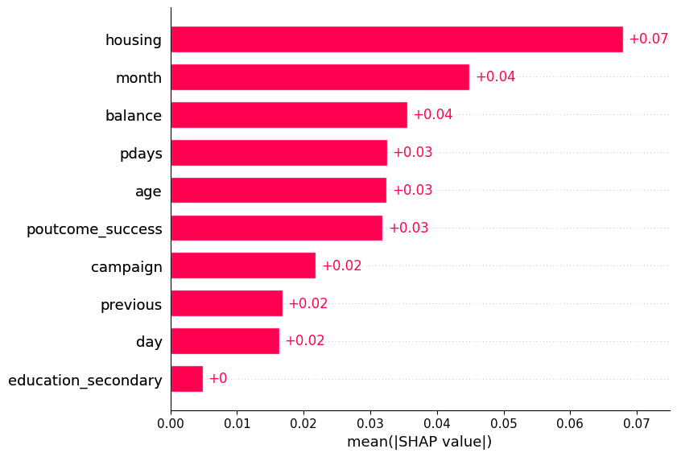

*Figure 12. Global feature importance measured by SHAP values.*

The feature *housing* was most influential, followed by *month*, 
*balance*, *pdays*, *age*, and *poutcome_success*. Features near the bottom of 
the plot contributed relatively little to the model's decisions.

---

### Feature Effects

The SHAP beeswarm plot shows both the importance of each 
feature and how different feature values influence the prediction.

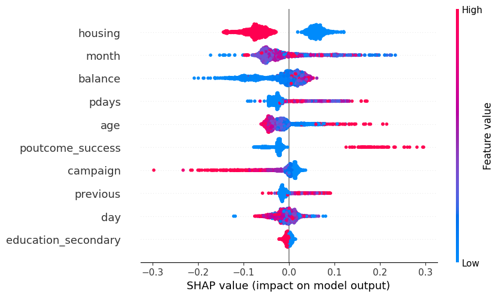

*Figure 13. SHAP beeswarm plot.*

Each point represents one customer. Features are ordered by 
importance, while the color indicates whether the feature value 
is relatively high (red) or low (blue). The horizontal position 
shows whether that feature increases or decreases the predicted probability 
of subscription. For example, customers without a housing loan 
tended to have higher predicted subscription probabilities, while 
higher account balances, older age, and a successful previous campaign 
generally increased the model's prediction.

---

### Individual Prediction

SHAP can also explain predictions for individual customers.

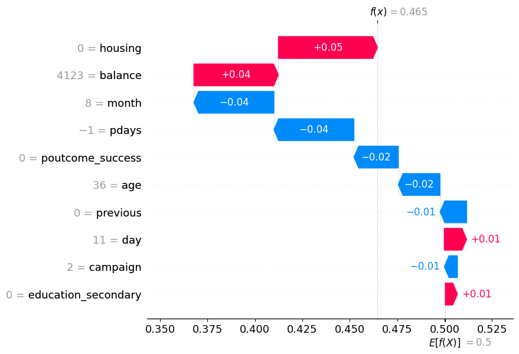

*Figure 14. SHAP waterfall plot for a single customer.*

The waterfall plot shows how each feature pushes 
the prediction higher or lower, starting from the model's 
baseline prediction and ending at the final predicted probability for that customer. 
For example, a successful previous campaign or a high balance may push the 
prediction toward “Yes,” while having a housing loan or being contacted many 
times may push it toward “No.” The final value is the model’s prediction after 
all feature contributions are combined. 

